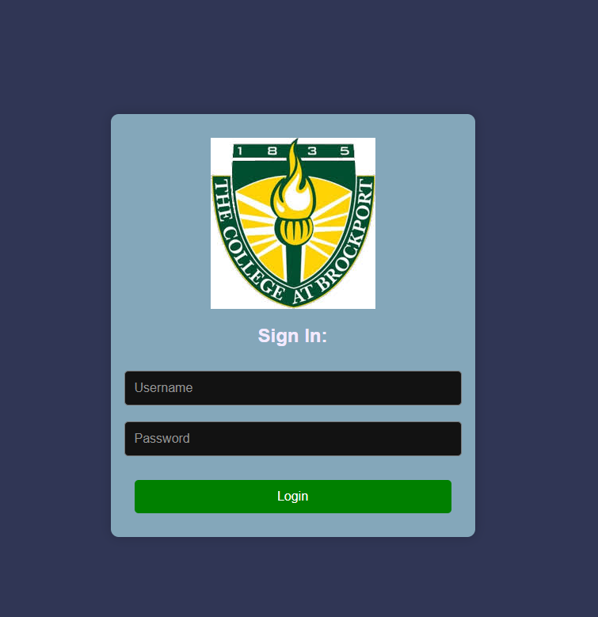

# CSC423 React Backend

School Project

## Team Members:
- David
- Adam
- Cassey
- Hmunn

## Course Registration Webapp

### A webapp for higher education students to register for courses.

## Features:
- Login/Logout
- Course Registration
- Course Drop
- View Courses
- Choose Major
- View Majors

## Roles:
- Admin
-- View Majors
-- View Courses
-- View Users
-- Add Major
-- Add Users

- Student
-- Register for course
-- View Courses
-- Choose Major

- Professor
-- View Courses
-- Add Courses
-- Remove Courses
-- Edit Courses

## Implementation

[Implementation guide](CSC423_ReactBackend/server/README.md)

## Frameworks
- React
- Node.js
- PostgreSQL
- Docker
- Docker Compose
- JWT

